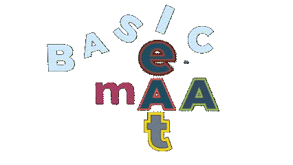

<h1 align="center"><i>awesome</i> <b>msdf</b></h1>

<p align="center"></p>

> ⚠️ This repo is still in development, so you may not find some of the listed *features*. ⚠️

***awesome-msdf*** is a collection of various *glsl shaders* utilizing **MSDF (multi-channel signed distance fields)** to render text in high quality while being *magnified*, *minified* or *rotated* in 3D space. It shows the basic usage of MSDF in text rendering with some additional, more advanced text modifiers.

All assets and characters were generated by the [msdfgen](https://github.com/Chlumsky/msdfgen) utility. Options to create the character assets were MTSDF (multi-channel *true* signed distance field) type with distance field pixel range of 6.

For *2D rendering*, you are better off using a rasterizer since there are no constant text size or rotation modifications, unlike in 3D rendering.

**Remember to** generate a texture atlas with [msdf-atlas-gen](https://github.com/Chlumsky/msdf-atlas-gen) utility and **not to** generate every character texture separately, as shown in the examples. The utility can also output an *arfont* file containing all character atlas positions, kerning info, spaces between characters and more.

## Shaders, tips and *real-time* output

> Read through the README in the [shaders](./shaders) folder for more detailed shader explanations and a few tips.

To see how the shaders work in real-time, you can download the [**SHADERed**](https://github.com/dfranx/SHADERed/releases) desktop application, open the ***'.sprj'*** file from the repo with the *SHADERed app* and see the output on the canvas. Learn more about *SHADERed* on their official [Tutorial website](https://shadered.org/docs/tutorials.html) or by watching [Youtube tutorials](https://www.youtube.com/playlist?list=PLK0EO-cKorzRAEfwHoJFiIldiyiyDR3-2).

## Basic MSDF usage

The following snippet shows the basic usage of an MSDF texture (*distance field pixel range 6*) to render text while preserving the highest quality. For more info, check out this [explanation](https://github.com/Chlumsky/msdfgen#using-a-multi-channel-distance-field) from the msdfgen creator.

```glsl
uniform sampler2D tex;

in vec2 uvCoord;
out vec4 outColor;

float median(float r, float g, float b) {
    return max(min(r, g), min(max(r, g), b));
}

float screenPxRange() {
    vec2 unitRange = vec2(6.0) / vec2(textureSize(tex, 0));
    vec2 screenTexSize = vec2(1.0) / fwidth(uvCoord);
    return max(0.5 * dot(unitRange, screenTexSize), 1.0);
}

void main() {
    vec4 texel = texture(tex, uvCoord);
    float dist = median(texel.r, texel.g, texel.b);

    float pxDist = screenPxRange() * (dist - 0.5);
    float opacity = clamp(pxDist + 0.5, 0.0, 1.0);

    outColor = vec4(0.5, 0.5, 0.5, opacity);
}
```

## Sources, links, articles, discussions, more info

Below are links to all the sources that helped me learn about MSDF and create this repo.

#### Introductory sources

- [What is state-of-the-art for text rendering in OpenGL as of version 4.1? - Stack Overflow](https://stackoverflow.com/questions/5262951/what-is-state-of-the-art-for-text-rendering-in-opengl-as-of-version-4-1) - A discussion about today's popular text rendering methods, including SDFs.
- [Text Rendering For Games](https://docs.google.com/presentation/d/1NCYNyR726F6j7vxwxFw0w0t8c6DUbiEMaxwMBbdP__0/edit#slide=id.g43674374e_046) - A presentation which covers three different ways to render text for games (one being SDFs).
- [The Valve paper](https://steamcdn-a.akamaihd.net/apps/valve/2007/SIGGRAPH2007_AlphaTestedMagnification.pdf) - A short *pdf* by *Valve* originally proposed using distance fields to render text.

#### About SDFs (Signed distance fields)

- [Glyphs, shapes, fonts, signed distance fields - YouTube](https://www.youtube.com/watch?v=1b5hIMqz_wM) - A short video explaining how to generate and use SDFs to render text or other 2D shapes.
- [Drawing Text with Signed Distance Fields in Mapbox GL](https://blog.mapbox.com/drawing-text-with-signed-distance-fields-in-mapbox-gl-b0933af6f817) - A short article covering how SDFs work and the basic usage of SDFs for text rendering.

#### Antialiasing SDF text

- [Cinder-SdfText: Initial Release (WIP) - Cinder](https://discourse.libcinder.org/t/cinder-sdftext-initial-release-wip) - A discussion about an SDF text renderer and improving the shader code to preserve the quality of minified SDF texts.
- [Signed-distance-field fonts look crappy at small pt sizes - JVM Gaming](https://jvm-gaming.org/t/solved-signed-distance-field-fonts-look-crappy-at-small-pt-sizes/49617) - A discussion about preserving the quality of scaled SDF texts.
- [Antialiasing with a signed distance field - Musing Mortoray](https://mortoray.com/antialiasing-with-a-signed-distance-field/) - An article explaining how to set up the shader code to utilize true antialiasing correctly.
- [Antialiasing For SDF Textures](https://drewcassidy.me/2020/06/26/sdf-antialiasing/) - An article showing different ways of setting up the shader code for better antialiasing. Some parts are based on the explanations of the article above.
- [Rendering Signed Distance Fields, Part 1 « Essential Math Weblog](http://www.essentialmath.com/blog/?p=111) - Part 1 of the blog explains the math behind the antialiasing of SDF text.
- [Rendering Signed Distance Fields, Part 2 « Essential Math Weblog](http://www.essentialmath.com/blog/?p=128) - Part 2 of the blog goes into more depth.
- [Rendering Signed Distance Fields, Part 3 « Essential Math Weblog](https://www.essentialmath.com/blog/?p=151) - Part 3 of the blog presents the final shader product for antialiasing.
- [Partial Derivatives (fwidth) | Ronja's tutorials](https://www.ronja-tutorials.com/post/046-fwidth/) - Explanation about what and how the partial derivate functions ***fwidth()***, ***ddx()*** and ***ddy()*** work *(in glsl terms dFdx() and dFdy())*.

#### MSDFs (Multi-channel signed distance field)

- [Chlumsky/msdfgen: Multi-channel signed distance field generator](https://github.com/Chlumsky/msdfgen) - A utility for generating SDF and M(T)SDF from vector shapes and fonts. Use [msdf-atlas-gen](https://github.com/Chlumsky/msdf-atlas-gen) to generate font atlases for rendering. **If this project hadn't existed, this repository wouldn't have existed either.**
- [Implementing SDF/MSDF Font In OpenGL](https://medium.com/@calebfaith/implementing-msdf-font-in-opengl-ea09a9ab7e00) - An article covering how MSDFs are generated, how they work and the basic usage of MSDFs for text rendering.
- [MSDF text rendering performance demonstration - YouTube](https://www.youtube.com/watch?v=r-2z-ccuZKE) - Short video presenting the performance of using MSDFs when rendering a lot of text. Note that minified text looks much worse than the rest, but I am convinced that methods used in this repository showcase avoid that efficiently.

#### Helpful code snippets

- [leochocolat/three-msdf-text-utils](https://github.com/leochocolat/three-msdf-text-utils/tree/main/src/MSDFTextMaterial/shaders),
- [suikki/sdf_text_sample](https://github.com/suikki/sdf_text_sample/tree/master/assets/shaders),
- [Evolut-Group-Pty-Ltd/Lavo-2.0](https://github.com/Evolut-Group-Pty-Ltd/Lavo-2.0/blob/main/src/scene/components/Text/frag.glsl),
- [wassy310/MJ_Simulator](https://github.com/wassy310/MJ_Simulator/blob/master/MJ_simulator/App/engine/shader/glsl/msdffont_outlineshadow.frag),
- [maltaisn/msdf-gdx](https://github.com/maltaisn/msdf-gdx/blob/master/lib/src/main/resources/font.frag),
- [MSDF Preview](https://gist.github.com/Chlumsky/263c960ae0a7df59afc2da4051eb0553),
- [Cierpliwy/sdf-test](https://github.com/Cierpliwy/sdf-test),
- [jinleili/sdf-text-view](https://github.com/jinleili/sdf-text-view/tree/master/shader-wgsl) - *wgsl* shaders,
- [TinySDF demo](https://mapbox.github.io/tiny-sdf/) - for experimenting with SDFs,
- [ShoYamanishi/SDFont](https://github.com/ShoYamanishi/SDFont/blob/master/shaders/VanillaSignedDistFontFragment.glsl)
- [MaxVell89/particles-animation](https://github.com/MaxVell89/particles-animation/blob/13f4bb7a3e41ad899f335b65092820291a28a694/src/js/modules/shader/msdf/fragment.glsl)

## The repo motive

There are two reasons why I wanted to make this repo. The first reason is that I am very interested in distance fields and their usage in rendering. Therefore, this repo helps me to understand and learn more. The second reason is the rare findings on this topic over the internet. While searching for code examples and usage information regarding the subject, I could only find a few articles. Also, searching on GitHub, I often found the same basic *code snippet* repeating itself in almost every repo. I want to fill this repo with as much information and code examples (basic to advanced) as possible so other people don't have to search aimlessly.

## Contributing and questions

All contributions, such as fixing grammar, adding new sources and improving shader code, are welcome.

If you have questions about the topic, feel free to post them in the [discussions section](https://github.com/Blatko1/awesome-msdf/discussions).
